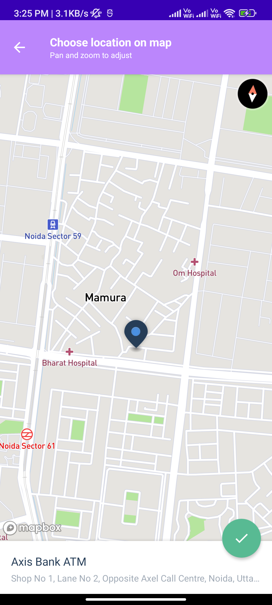
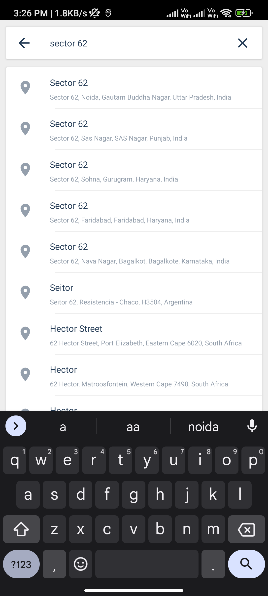

# Mapbox-navigation-search-places-name
Mapbox example with navigation, Route, Place Search ,and Place Picker

# Screenshots

<p align="center">
  
  
  
  
  
  
  
</p>


# Dependencies

```
    implementation("androidx.multidex:multidex:2.0.1")
    implementation 'com.squareup.okhttp3:okhttp:4.9.0'
    implementation 'com.google.android.material:material:1.0.0'

    implementation 'com.mapbox.mapboxsdk:mapbox-android-sdk:9.0.0'
    implementation 'com.mapbox.mapboxsdk:mapbox-android-navigation-ui:0.42.6'
    implementation 'com.mapbox.mapboxsdk:mapbox-android-plugin-places-v9:0.12.0'
    implementation 'com.mapbox.mapboxsdk:mapbox-android-telemetry:5.0.0'

```


